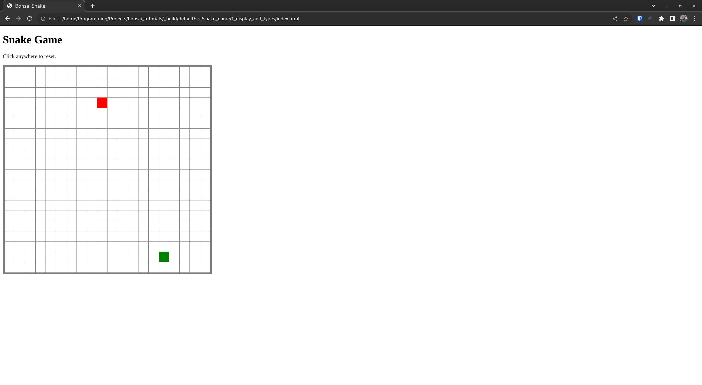

# Displaying a (Static) Board

In the [last chapter](./0_hello_world.md), we saw how to build and access our
web app, and went over a high-level design of Snake.

In this chapter, we'll design (.mlis) and implement functions for the base types that
our Snake implementation will be based around:

- `Position.t` and `Direction.t`, which represent coordinates and directions on the game grid, respectively.
- `Apple.t`, a type encapsulating the position of the apple, and functions to spawn a new apple.
- `Player_status.t`, which represents whether the game is in progress or inactive, and if applicable, why the game ended.
- `Snake.t`, which encapsulates the positions and growth state of the snake, and functions for
  getting the positions, checking whether it has eatten itself, spawning new snakes, etc.

We'll also implement `Board.component`, which renders the game into HTML Vdom, as a function
of the current state.

By the end of this chapter, our game will look like this:

It won't work yet; that will happen in the next chapter, when we implement interactivity
and state transitions using Bonsai's state primitives.

## Types and Logic

### Position.t

### Direction.t

### Player_status.t

### Apple.t

### Snake.t

## Displaying the Board

## Exercises

- Improve the snake spawning function. Longer snake to start.
- Make the page layout prettier
- Make the snake head look different.
