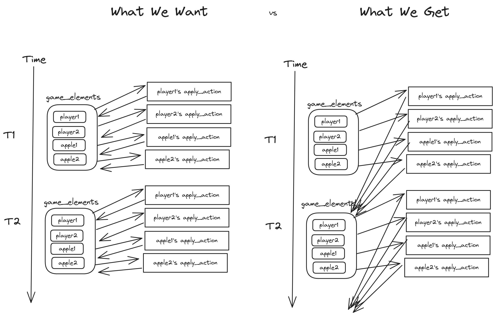
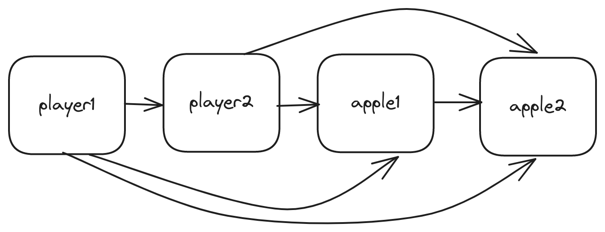

# Two Player Snake

In the [last chapter](./2_state_machines.md),
we built a working version of Snake using Bonsai's state machine design.

In this chapter, we'll showcase Bonsai's flexibility by adding
a second snake (controlled by the arrow keys) and more apples.

We'll dive deeper into computation composition,
what incrementality really means,
and how things are scheduled in Bonsai.

For simplicity, the snakes will be completely independent.
One player can continue even if the other's game has ended.
They'll also be allowed to overlap;
collision behavior is left as an exercise at the end of this chapter.
Apples, however, may not be placed on top of each other, or on top of snakes.

## Design Differences

In the [previous chapter](./2_state_machines.md#implementing-state),
dependency structure was obvious.
The apple needs to *always* know the snake's position,
since it spawns second, and needs to react to the snake's movement.

Here, things are trickier, since everything depends on everything else:

- Apples need to know where all the apples are, so they don't spawn on top of each other.
- Apples also need to know where all the snakes are, so that they can check if they've been eatten, and immediately respawn.
- Snakes need to know where all the apples are, so they know if they've eatten one.

As will be explained shortly,
we can't have state machines take each other as input anymore,
because that would create cycles.
Instead, we'll define a `Game_elements.t`,
which is a collection of all `Snake.t`s and `Apple.t`s,
and pass that as an argument to the `Move`, `Tick`, `Restart`, and `Place` actions.

## `Game_elements.t`

Create `game_element.mli` with the following contents:

<!-- $MDX file=../../src/snake_game/3_two_player_snake/src/game_elements.mli -->
```ocaml
open! Core

type t =
  { snakes : Snake.t list
  ; apples : Apple.t list
  }
[@@deriving sexp]

(** [occupied_pos t] returns the list of all positions occupied by some game element. *)
val occupied_pos : t -> Position.t list
```

And the corresponding implementation:

<!-- $MDX file=../../src/snake_game/3_two_player_snake/src/game_elements.ml -->
```ocaml
open! Core

type t =
  { snakes : Snake.t list
  ; apples : Apple.t list
  }
[@@deriving sexp]

let occupied_pos t =
  let snake_pos = t.snakes |> List.map ~f:Snake.list_of_t |> List.join in
  let apple_pos = t.apples |> List.map ~f:Apple.list_of_t |> List.join in
  snake_pos @ apple_pos
;;
```

By putting all these in one place, it becomes much easier to find `invalid_pos`
arguments for spawning snakes and apples: just use all currently `occupied_pos`!

## Updating State Machines

### Player

Update the `Action` types to take `Game_elements.t` in `player_state.mli`:

<!-- $MDX file=../../src/snake_game/3_two_player_snake/src/player_state.mli,part=action -->
```ocaml
module Action : sig
  type t =
    | Restart of Game_elements.t
    | Move of Game_elements.t
    | Change_direction of Direction.t
end
```

and in `player_state.ml`:

<!-- $MDX file=../../src/snake_game/3_two_player_snake/src/player_state.ml,part=action -->
```ocaml
module Action = struct
  type t =
    | Restart of Game_elements.t
    | Move of Game_elements.t
    | Change_direction of Direction.t
  [@@deriving sexp]
end
```

We'll also need to change `apply_action` in `player_state.ml`.
The `Restart` case now takes a `Game_elements.t`,
and makes sure that snakes don't spawn on already occupied spots:

<!-- $MDX file=../../src/snake_game/3_two_player_snake/src/player_state.ml,part=apply_restart -->
```ocaml
  | Restart game_elements, _ ->
    let invalid_pos = Game_elements.occupied_pos game_elements in
    let snake = Snake.spawn_random_exn ~rows ~cols ~color ~invalid_pos in
    { Model.score = 0; snake; status = Playing }
```

The `Move` case also takes a `Game_elements.t`,
and checks whether the snake has eatten any of the apples,
since there is now a list of them:

<!-- $MDX file=../../src/snake_game/3_two_player_snake/src/player_state.ml,part=apply_move -->
```ocaml
  | Move game_elements, Playing ->
    let ate_apple_score = 1 in
    let snake = Snake.move model.snake in
    if Snake.is_eatting_self snake
    then { model with status = Game_over Ate_self }
    else if Snake.is_out_of_bounds ~rows ~cols snake
    then { model with status = Game_over Out_of_bounds }
    else (
      let ate_apple =
        game_elements.apples
        |> List.filter ~f:(Snake.is_eatting_apple snake)
        |> List.length
        > 0
        |> Bool.to_int
      in
      { model with
        snake = Snake.grow_eventually ~by:ate_apple snake
      ; score = model.score + (ate_apple * ate_apple_score)
      })
```

### Apple

Similarly, we'll want to update the `Action` module in `apple_state.mli`:

<!-- $MDX file=../../src/snake_game/3_two_player_snake/src/apple_state.mli,part=action -->
```ocaml
module Action : sig
  type t =
    | Place of Game_elements.t
    | Tick of Game_elements.t
  [@@deriving sexp]
end
```

and in `apple_state.ml`:

<!-- $MDX file=../../src/snake_game/3_two_player_snake/src/apple_state.ml,part=action -->
```ocaml
module Action = struct
  type t =
    | Place of Game_elements.t
    | Tick of Game_elements.t
  [@@deriving sexp]
end
```

Since we're no longer using dependencies,
because all the apples depending on each other would cause a cycle,
We'll also remove the `snake` input from the `component` signature in `apple_state.mli`:

<!-- $MDX file=../../src/snake_game/3_two_player_snake/src/apple_state.mli,part=computation -->
```ocaml
val computation
  :  rows:int
  -> cols:int
  -> default_apple:Model.t
  -> (Model.t * (Action.t -> unit Effect.t)) Computation.t
```

and from the implementation in `apple_state.ml`:

<!-- $MDX file=../../src/snake_game/3_two_player_snake/src/apple_state.ml,part=computation -->
```ocaml
let computation ~rows ~cols ~default_apple =
  Bonsai.state_machine0
    (module Model)
    (module Action)
    ~default_model:default_apple
    ~apply_action:(apply_action ~rows ~cols)
;;
```

We'll also need to update `apply_action` in `apple_state.ml`.

Firstly, the `snake` input is no longer present.
We can remove it and the `Computation_status` match:

<!-- $MDX file=../../src/snake_game/3_two_player_snake/src/apple_state.ml,part=apply_sig -->
```ocaml
let apply_action ~rows ~cols ~inject ~schedule_event model action =
  match action with
```

For the `Place` action, we'll compute `invalid_pos`
with `Game_elements.occupied_pos`:

<!-- $MDX file=../../src/snake_game/3_two_player_snake/src/apple_state.ml,part=apply_place -->
```ocaml
  | Action.Place game_elements ->
    let invalid_pos = Game_elements.occupied_pos game_elements in
    Apple.spawn_random_exn ~rows ~cols ~invalid_pos
```

And for `Tick`, we'll need to check if *any* of the snakes
are eatting the apple:

<!-- $MDX file=../../src/snake_game/3_two_player_snake/src/apple_state.ml,part=apply_tick -->
```ocaml
  | Tick game_elements ->
    if List.exists game_elements.snakes ~f:(fun s -> Snake.is_eatting_apple s model)
    then schedule_event (inject (Action.Place game_elements));
    model
;;
```

## Updating the Board

The required changes to `Board` are similarly straightforward.
We still need to take a `Player_state.Model.t Value.t` for each player,
so that the scores/statuses can be displayed.
However, instead of an `Apple.t Value.t`, we can just pass in
a `Game_elements.t Value.t`, and use that to display all the
snakes and apples.

<!-- $MDX file=../../src/snake_game/3_two_player_snake/src/board.mli -->
```ocaml
open! Core
open! Bonsai_web

val component
  :  rows:int
  -> cols:int
  -> Player_state.Model.t Value.t
  -> Player_state.Model.t Value.t
  -> Game_elements.t Value.t
  -> Vdom.Node.t Computation.t
```

In `board.ml`, we'll adjust `component`'s signature accordingly,
use the `Game_elements.t Value.t` input to build `cell_style_driver`,
and display a second status for the other player.

<!-- $MDX file=../../src/snake_game/3_two_player_snake/src/board.ml,part=component -->
```ocaml
let component ~rows ~cols player1 player2 (game_elements : Game_elements.t Value.t) =
  let open Bonsai.Let_syntax in
  let%arr player1 = player1
  and player2 = player2
  and game_elements = game_elements in
  let cell_style_driver =
    merge_cell_style_drivers ~snakes:game_elements.snakes ~apples:game_elements.apples
  in
  Vdom.(
    Node.div
      ~attrs:
        [ Attr.css_var ~name:"grid-rows" (Int.to_string rows)
        ; Attr.css_var ~name:"grid-cols" (Int.to_string cols)
        ]
      [ Node.h1 [ Node.text "Snake Game" ]
      ; Node.p [ Node.text "Click anywhere to reset." ]
      ; Node.div
          [ view_score_status ~label:"Player 1" player1
          ; view_score_status ~label:"Player 2" player2
          ]
      ; view_game_grid rows cols cell_style_driver
      ])
;;
```

And with that, we just need to figure out how to compose all this together.

## `app.ml` Changes

The first few changes to `app.ml` are easy.

We want to support a dynamic number of apples. For example, 5.
Add a `num_apples` constant to the top of `app.ml`, alongside `rows` and `cols`:

<!-- $MDX file=../../src/snake_game/3_two_player_snake/src/app.ml,part=num_apples -->
```ocaml
let rows = 20
let cols = 20
let num_apples = 5
```

Then, we want to create our `Player_state` and `Apple_state` state machines.
As before, we'll initialize `default_snake1` and `default_snake2` in `app.ml`,
so that the starting positions don't overlap.
This time, we'll just have 2 players instead of 1:

<!-- $MDX file=../../src/snake_game/3_two_player_snake/src/app.ml,part=player_state -->
```ocaml
let component =
  let open Bonsai.Let_syntax in
  let default_snake1 =
    Snake.spawn_random_exn ~rows ~cols ~invalid_pos:[] ~color:(`Name "green")
  in
  let default_snake2 =
    let invalid_pos = Snake.list_of_t default_snake1 in
    Snake.spawn_random_exn ~rows ~cols ~invalid_pos ~color:(`Name "blue")
  in
  let%sub player1, player1_inject =
    Player_state.computation ~rows ~cols ~default_snake:default_snake1
  in
  let%sub player2, player2_inject =
    Player_state.computation ~rows ~cols ~default_snake:default_snake2
  in
```

Creating the apples is a tiny bit trickier:

- We'll create a `num_apples`-length empty list
- Then, we'll `List.fold` over it and create `num_apples` state machines.
  Folding is necessary because we need to accumulate all the starting positions
  of the first `n` apples, and use that as `invalid_pos` for the `n+1`th apple.
- Then, we'll use `Computation.all` to combine our list of computations into
  a single `(Apple.t, apple_inject) list Computation.t`
- Finally, we'll `Computation.map` over it to separate the `Apple.t`s
  and their `inject` functions.

<!-- $MDX file=../../src/snake_game/3_two_player_snake/src/app.ml,part=apple_state -->
```ocaml
  let%sub apples, apple_injects =
    List.init num_apples ~f:(fun _ -> ())
    |> List.fold ~init:([], []) ~f:(fun (apple_acc, invalid_pos) _ ->
         let new_apple = Apple.spawn_random_exn ~rows ~cols ~invalid_pos in
         let new_apple_sm =
           Apple_state.computation ~rows ~cols ~default_apple:new_apple
         in
         new_apple_sm :: apple_acc, Apple.list_of_t new_apple @ invalid_pos)
    |> Tuple2.get1
    |> Computation.all
    |> Computation.map ~f:(fun x -> List.map ~f:Tuple2.get1 x, List.map ~f:Tuple2.get2 x)
  in
```

With all the snake and apple state machines in place,
we'll map them a `Game_elements.t` container:

<!-- $MDX file=../../src/snake_game/3_two_player_snake/src/app.ml,part=game_elements -->
```ocaml
  let%sub game_elements =
    let%arr player1 = player1
    and player2 = player2
    and apples = apples in
    { Game_elements.snakes = [ player1.snake; player2.snake ]; apples }
  in
```

We also need to modify our `on_keydown` definition to add keybindings
for Player 2's snake:

<!-- $MDX file=../../src/snake_game/3_two_player_snake/src/app.ml,part=on_keydown -->
```ocaml
  let%sub on_keydown =
    let%arr player1_inject = player1_inject
    and player2_inject = player2_inject in
    fun evt ->
      match get_keydown_key evt with
      | "w" -> player1_inject (Change_direction Up)
      | "s" -> player1_inject (Change_direction Down)
      | "a" -> player1_inject (Change_direction Left)
      | "d" -> player1_inject (Change_direction Right)
      | "ArrowUp" -> player2_inject (Change_direction Up)
      | "ArrowDown" -> player2_inject (Change_direction Down)
      | "ArrowLeft" -> player2_inject (Change_direction Left)
      | "ArrowRight" -> player2_inject (Change_direction Right)
      | _ -> Effect.Ignore
  in
```

And provide the proper inputs to `Board.component`:

<!-- $MDX file=../../src/snake_game/3_two_player_snake/src/app.ml,part=board -->
```ocaml
  let%sub board = Board.component ~rows ~cols player1 player2 game_elements in
```

Now, all that's left is to update `clock_effect` and `on_reset`.
But here, we run into a problem.

## The Challenge

### Background on `apply_action` Inputs

There are two ways to provide external data to a Bonsai state machine's `apply_action` logic:

1. We can pass it in the `Action.t` itself.
   For example, last time we passed `Apple.t` to `Player_state` through the `Move of Apple.t` action,
   and `Direction.t` through the `Change_direction of Direction.t` action.
2. We can make it an input to the state machine with `state_machine1`.
   Last chapter, `Snake.t` was an input to `Apple_state.computation`.

To understand how these are functionally different,
we need to think a bit about how Bonsai's incrementality and event scheduling work together.

Let's dive in by examining the "tick" implementation from last chapter,
which dispatches `Move` and `Tick` actions to the player and apple on an interval.
Here's the code again:

<!-- $MDX file=../../src/snake_game/2_state_machines/src/app.ml,part=tick -->
```ocaml
  let%sub () =
    let%sub clock_effect =
      let%arr player_inject = player_inject
      and apple_inject = apple_inject
      and apple = apple in
      Effect.Many [ player_inject (Move apple); apple_inject Tick ]
    in
    Bonsai.Clock.every
      ~when_to_start_next_effect:`Every_multiple_of_period_blocking
      (Time_ns.Span.of_sec 0.25)
      clock_effect
  in
```

`clock_effect` is an incrementally computed `unit Effect.t Value.t`.
Remember than `unit Effect.t` is a task that we tell Bonsai to do.
`Value.t` is like a cell in a spreadsheet. When its inputs change,
the value it contains will change. Just a recap.

Anyways, every 0.25 seconds, `Bonsai.Clock.every` will
take the current value of `clock_effect`, which is a `unit Effect.t`,
and schedule that on the event-queue. Let's name this `curr_clock_effect`.

`curr_clock_effect` is **not** incremental. It's defined by:

<!-- $MDX skip -->
```ocaml
Effect.Many [ player_inject (Move apple); apple_inject Tick ]
```

Where `apple`, `apple_inject`, and `player_inject` are the values
of the corresponding `Value.t`s *at the time the effect was scheduled*.
That's the key detail: incrementality is not laziness.
`Value.t`s always contain some *regular OCaml value*,
and once if we take that value out, it's locked into place.

### Naive Attempt

Let's take a look at a naive implementation of `clock_effect` for multiple snakes and apples:

<!-- $MDX skip -->
```ocaml
let%sub clock_effect =
  let%arr game_elements = game_elements
  and player1_inject = player1_inject
  and player2_inject = player2_inject
  and apple1_inject = apple1_inject
  and apple2_inject = apple2_inject
  in
  Effect.Many [
    player1_inject (Move game_elements);
    player2_inject (Move game_elements);
    apple1_inject (Tick game_elements);
    apple2_inject (Tick game_elements);
  ]
in
...
```

The behavior we would like to see is:

1. The `unit Effect.t` is queued, and eventually
2. The first `player1_inject (Move game_elements)` effect is executed.
   As a result, Player 1's model is changed.
3. The second `player2_inject (Move game_elements)` effect is executed.
   As a result, Player 2's model is changed.
4. The `apple_inject (Move game_elements)` effects are executed,
   where `game_elements` includes the **new, up-to-date** `Player_state` models.

But `game_elements` was locked into place
when `clock_effect` was last incrementally adjusted,
befoe it was queued.

As a result, `game_elements` contains `Snake.t` and `Apple.t` values from
right before the effect was queued. This means that apples won't
see snakes moving until the next turn, and that two apples
could respawn on the same spot, since neither is aware that the other has been re-placed.



We didn't have this issue last chapter because `Snake.t Value.t`
was an input of the `Apple_state` state machines.
In `state_machine1`, the `input` is resolved right before `apply_action` is called,
so changes caused by previous effects propogated correctly.

Unfortunately, this wouldn't work with multiple snakes and apples.
Because everything depends on each other,
we would have a cycle in our computation graph,
which is not allowed in Bonsai.

We also can't "chain" dependencies:



Apple2 knows where apple1 is, and won't spawn on top.
But Apple1 could respawn on top of apple2 if eatten.

So just using inputs isn't an option.
We'll have to figure out a way to get up-to-date state through action arguments.

> **Note** We could make everything mutable, of course, but that would be cheating.

If only we could insert `Game_element.t` at the last minute
instead of locking it in when the effect is computed,
long before it gets run...

## Chaining Incremental Effects

We'll solve this with a helper `state_machine1`
that takes `Game_elements.t Value.t` as input.
Instead of `unit Effect.t list`, we'll give it `(Game_elements.t -> unit Effect.t) list`.
It will use its input to give each effect an up-to-date `Game_elements.t`
before dispatching it.

Create `chain_incr_effects.mli` with the following signature:

<!-- $MDX file=../../src/snake_game/3_two_player_snake/src/chain_incr_effects.mli -->
```ocaml
open! Core
open Bonsai

(** [component dep effect_fns] allows you to sequentially schedule effects that depend
    on an incrementally-computed ['a Value.t], allowing the dependency to change between
    the execution of each effect.

    This is particularly useful for modeling a set of interacting state machines.
    The outputs of each computation can be collected into a single [Value.t],
    which is then provided to each state machine through an injected action.
    This util allows model recomputations made in the `i`th state machine to be
    immediately visible to the [apply_action] logic of the `i+1`th state machine.
    
    In contrast, just resolving a value with [let%arr] and scheduling multiple dependent
    effects with `[Effect.Many]` will provide all state machines
    with the state of the world before *any* of them recalculated state.
    
    See [this issue](https://github.com/janestreet/bonsai/issues/33) for more information. *)
val scheduler
  :  'a Value.t
  -> (('a -> unit Ui_effect.t) list -> unit Ui_effect.t) Computation.t
```

When you call this component with a `'a Value.t`,
you get a `(('a -> unit Ui_effect.t) list -> unit Ui_effect.t) Computation.t`.
Within the scope of a  `let%sub` and `let%arr`,
that can be combined with a `('a -> unit Ui_effect.t) list`
to produce a `unit Effect.t`.

That probably sounds confusing, so let's see how it's used.
I'll explain the implementation after.

### Using the Scheduler

In `app.ml`, right under the `game_elements` definition,
initialize a `Chain_incr_effects.scheduler`:

<!-- $MDX file=../../src/snake_game/3_two_player_snake/src/app.ml,part=scheduler -->
```ocaml
  let%sub scheduler = Chain_incr_effects.scheduler game_elements in
```

Using `scheduler` is fairly similar to `Effect.Many`,
except that we need to use `let%arr` to gain access to it,
and we need to provide `Game_element.t -> unit Effect.t`s
instead of `unit Effect.t`s.

Here's how our `clock_effect` code will change:

<!-- $MDX file=../../src/snake_game/3_two_player_snake/src/app.ml,part=tick -->
```ocaml
  let%sub () =
    let%sub clock_effect =
      let%arr player1_inject = player1_inject
      and player2_inject = player2_inject
      and apple_injects = apple_injects
      and scheduler = scheduler in
      scheduler
        ([ (fun g -> player1_inject (Move g)); (fun g -> player2_inject (Move g)) ]
         @ List.map apple_injects ~f:(fun inject game_elements ->
             inject (Tick game_elements)))
    in
    Bonsai.Clock.every
      ~when_to_start_next_effect:`Every_multiple_of_period_blocking
      (Time_ns.Span.of_sec 0.25)
      clock_effect
  in
```

It looks a little more complicated,
but that's mostly because we now have a list of `apple_injects` instead of a fixed number.
Note that when we map the curried `fun inject game_elements -> ...`,
we're left with a bunch of `Game_element.t -> unit Effect.t`s, as desired.

Similarly, modify `on_reset` to use `scheduler`:

<!-- $MDX file=../../src/snake_game/3_two_player_snake/src/app.ml,part=reset -->
```ocaml
  let%sub on_reset =
    let%arr player1_inject = player1_inject
    and player2_inject = player2_inject
    and apple_injects = apple_injects
    and scheduler = scheduler in
    scheduler
      ([ (fun g -> player1_inject (Restart g)); (fun g -> player2_inject (Restart g)) ]
       @ List.map apple_injects ~f:(fun inject game_elements ->
           inject (Tick game_elements)))
  in
```

### Implementation

So how does this magic `chain_incr_effects` actually work?

Internally, it uses a `state_machine1` with a `Game_elements.t Value.t` input.
Its only action is `Run of (Game_elements.t -> unit Effect.t) list`.
That's handled by popping off the first `(Game_elements.t -> unit Effect.t)`,
applying the up-to-date `Game_elements.t` to obtain a `unit Effect.t`,
dispatching that via `schedule_event`,
and then dispatching a new `Run` with the other effect creation functions.

Create `chain_incr_effects.ml`, explicitly specifying the signature:

<!-- $MDX file=../../src/snake_game/3_two_player_snake/src/chain_incr_effects.ml,part=sig -->
```ocaml
open! Core
open Bonsai

let scheduler
  : type input.
    input Value.t -> ((input -> unit Ui_effect.t) list -> unit Ui_effect.t) Computation.t
  =
```

We make the `input` type generic for flexibility, but in our use case, `input = Game_elements.t`.

Then, define the `Run` action:

<!-- $MDX file=../../src/snake_game/3_two_player_snake/src/chain_incr_effects.ml,part=action -->
```ocaml
  let module Action = struct
    type t = Run of (input -> unit Effect.t) list [@@deriving sexp]
  end
  in
```

And the `apply_action` handler:

<!-- $MDX file=../../src/snake_game/3_two_player_snake/src/chain_incr_effects.ml,part=apply_action -->
```ocaml
  let apply_action ~inject ~schedule_event input _model (Action.Run effect_fns) =
    match input, effect_fns with
    | Bonsai.Computation_status.Active input_val, effect_fn :: dependents ->
      schedule_event (Effect.Many [ effect_fn input_val; inject (Action.Run dependents) ])
    | _, [] | Inactive, _ -> ()
  in
```

Then, we wrap all this in `Bonsai.state_machine1`:

<!-- $MDX file=../../src/snake_game/3_two_player_snake/src/chain_incr_effects.ml,part=sm_def -->
```ocaml
  let open Bonsai.Let_syntax in
  let%sub (), inject =
    Bonsai.state_machine1
      (module Unit)
      (module Action)
      ~default_model:()
      ~apply_action
      input
  in
```

Note that we're only using this state machine for its `apply_action` function.
We don't care about the `Model.t`, so we set it to `module Unit`, and only take the `inject` output.

If we stopped here, we'd have `input Value.t -> (Action.t -> unit Effect.t) Computation.t`,
but the `Run` action is really just an implementation detail, and we shouldn't expose it.

Instead, we'll finish by constructing a function that takes the desired `(input -> unit Effect.t) list`,
and uses `inject` to create a `unit Effect.t` which dispatches `Run effects`:

<!-- $MDX file=../../src/snake_game/3_two_player_snake/src/chain_incr_effects.ml,part=inject -->
```ocaml
  let%arr inject = inject in
  fun effects -> inject (Action.Run effects)
;;
```

## Conclusion

And with that, multi-player Snake is done. Congratulations!
Over these chapters, we dived deep into Bonsai's state machine tools,
how incrementality works, and how elegant composing state in Bonsai can be.

After a well-deserved break,
I highly recommend trying the exercises at the ends of these chapters.
I've done my best to cover this material one piece at a time,
with extensive background and explanation,
but the best way to become proficient in Bonsai is to start hacking away at it.

## Exercises

### Snake Interactions

Try crashing one snake into another. Nothing happens!
I didn't address snake collisions in this chapter for simplicity,
leaving it as an exercise so you can customize the game.

Here's some ideas:

- Maybe the larger one wins?
- Or the one with a higher score?
- Or the one that crashed loses?
- Maybe they collaborate in some way?

<details>
  <summary>Hint</summary>

  > `Game_element.t`'s `snakes` field provides ALL snakes, but if we're trying to
  > implement how a snake should interact with others, we need to build a `Game_elements.snakes_other_than`
  > function.
  > Try deriving `Snake.equal`.
</details>

### Fruit Types!

A world where the only food is apples is boring.
Deadly, even, for some in the medical profession.
Consider adding more fruit types!
These could have different shapes, sizes, and effects.

For example, maybe bananas boost the score,
or pineapples make snakes shrink.
Maybe some fruits could initially occupy several spaces,
but get eatten one cell at a time.
You could even add obstacles that end the game
if the snake crashes into them.
The sky's the limit!

<details>
  <summary>Hint</summary>

  > Replace `Apple` with `Food`, and add a `food_type` variant.
  > Reimplement everything relating to food as a pattern match on that `food_type` variant.
  > When a new food is created, randomly select which `food_type` it should be.
</details>

### AI Snakes!

Games are always more fun with competition.
Add one (or more!) AI-powered snakes that will automatically
head towards food, while avoiding crashing into other snakes.

<details>
  <summary>Hint</summary>

  > Create a new `AI_player` computation that wraps `Player_state.computation`.
  > Its only action should be `Tick of Game_elements.t`.
  > To handle it, process the game grid as a graph (excluding cells occupied by snakes),
  > and run a path-finding algorithm to decide if the snake needs to `Change_direction`.
  > Then, dispatch `Move` to the internal `Player_state.computation`.
</details>

### Configuration Form

Wouldn't it be nice if you could make the game grid bigger,
or add more food, without having to edit code and recompile the game every time?

Add a [form](https://bonsai.red/04-forms.html) that controls grid size,
how many apples there are. etc.


<details>
  <summary>Hint</summary>

  > Create a [form](https://bonsai.red/04-forms.html) that edits `int Value.t`s
  > for `rows`, `cols`, and `num_apples`, as well as any other config parameters
  > you've added in exercises.
  > Dispatch `on_reset` whenever the form is successfully submitted.
  > Then, you'll need to change `Player_state` and `Apple_state` to take
  > rowxcol as inputs, through `state_machine1`.
  > You should still have a hardcoded default value for the form,
  > and for initializing all the `default_snake`s and `default_apple`s.
  > You'll need to use `Bonsai.assoc` to generate the variable
  > number of apples.
  > See [this gist](https://github.com/TyOverby/composition-comparison#04---multiplicity)
  > for an example.
</details>
