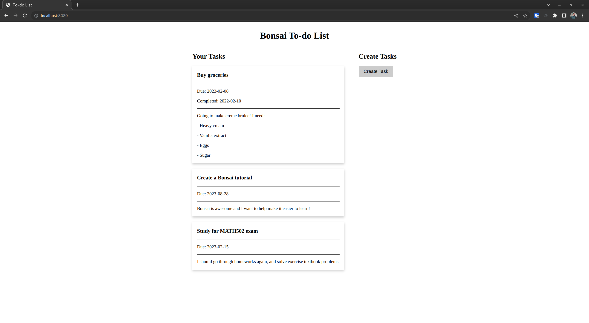

# Building a Static Todo List

Now that you're familiar with the starter code, let's start building our todo list!

For now, we want to display a static list of tasks, and make a space where
the "create task" form will eventually go. Here's what it will look like:



In this chapter, we'll:

- Define the data model for our Todo tasks, which will be used in both the frontend and backend.
- Create some simple, static components. Essentially, you'll learn how to write HTML and CSS in OCaml.
- Gently introduce the `let%sub` and `let%arr` operators, and the `Computation.t` and `Value.t` types, which are central to Bonsai.

We recommend pairing it with:

- The [Virtual_dom documentation](https://bonsai.red/01-virtual_dom.html)
- Docs about [the core Value.t and Computation.t types](https://bonsai.red/02-dynamism.html)
- Bonsai's [guide to CSS and styling](https://bonsai.red/08-css.html)

## Defining Data Models

A to-do list is a web UI wrapper around displaying, creating, and editing tasks.
Before we can implement these (and other) features, we need to define what a task *is*.

In full-stack web development with separate frontends and backends, data typically lives
in a database such as PostgreSQL, MySQL, SqLite, or MongoDB. When the frontend wants to
get or change data, the backend will perform database queries, and return the results to
the frontend, as a serialized data structure. Because our frontend and backend are both in
OCaml, they can share the same data model!

A simple task should probably have a title, description, id, due date, and completion status.
So that's exactly what our model will look like! In `common`, create `task.ml` with the following
contents:

<!-- $MDX file=../../src/todo_list/1_static_components/common/task.ml -->
```ocaml
open! Core

module Completion_status = struct
  type t =
    | Todo
    | Completed of Date.t
  [@@deriving sexp, bin_io, variants]
end

type t =
  { id : int
  ; title : string
  ; description : string
  ; due_date : Date.t
  ; completion_status : Completion_status.t
  }
[@@deriving sexp, bin_io, fields]
```

The `sexp` and `bin_io` ppx derivers allow our model to be serialized/deserialized
for testing and communication between the frontend/backend, respectively.
`fields` and `variants` provide some utils for accessing fields (or variant options)
of the data structure.

We could have represented `completion_status` as `Date.t option`, but defining a variant
is more descriptive, and could eventually support more statuses, such as "In Progress", or
"Procrastinating".

The corresponding `task.mli` should be pretty much identical:

<!-- $MDX file=../../src/todo_list/1_static_components/common/task.mli -->
```ocaml
open! Core

module Completion_status : sig
  type t =
    | Todo
    | Completed of Date.t
  [@@deriving sexp, bin_io, variants]
end

type t =
  { id : int
  ; title : string
  ; description : string
  ; due_date : Date.t
  ; completion_status : Completion_status.t
  }
[@@deriving sexp, bin_io, fields]
```

## Static Components in Bonsai

Now, onto the Bonsai part!
For the bulk of this chapter, we'll:

- Introduce components and the core types of Bonsai.
- Implement the task list and create task placeholder components.
- Learn component composition, combining them into the screenshot you saw
  at the start of this chapter.

### What is a Component?

As mentioned in the [last article](./0_hello_world.md),

> Bonsai components are [incremental](https://blog.janestreet.com/introducing-incremental/)
computations, producing ["virtual" HTML](https://bonsai.red/00-introduction.html#the-underlying-machinery)
that's displayed in the browser.

If you're unfamiliar with Incremental, think of it as OCaml's Excel.
Cells can depend on other cells, and will only change when their dependencies change.
Bonsai has 2 key types that you should be aware of.

- `'a Value.t` is an incrementally computed value, or more accurately,
  a node in the incremental computation graph. You'll see it next chapter.
  Thinking in Excel, an `'a Value.t` is what we see in a cell: it may be a
  standalone variable, or it might be the output of some formula.
  It might also change over time, either if we edit the cell
  (for standalone variables), or if any inputs to the cell's formula change.
- `'a Computation.t` is a blueprint/formula for producing a Value.t.
  In our Excel analogy, a Computation.t is the formula we see when we double-click a cell.

The type of Bonsai "component" is `'a Computation.t`, or a function returning
`'a Computation.t`.

The components you're most used to are `Vdom.Node.t Computation.t`, which produce HTML.
But a component can produce anything; anything and everything can be incrementally
computed. This is part of what makes Bonsai so powerful.

See [this gist](https://gist.github.com/TyOverby/daf9a92db08d1c724f298bfb943f5a3e)
and [the Bonsai docs](https://bonsai.red/02-dynamism.html) for more background on Bonsai components.
You don't need to immediately understand all of it, but keep these analogies in mind
through the rest of this tutorial.

### Create Task Placeholder

We'll start with the "Create Task" section, since it's simple:
It will eventually be expanded into a working form, but for now
it's just a button that alerts "Not yet implemented" when pressed.

In `client`, create `create_task.mli` with the following content,
since we're just making one component that takes no inputs:

<!-- $MDX file=../../src/todo_list/1_static_components/client/create_task.mli -->
```ocaml
open! Core
open! Bonsai_web

val component : Vdom.Node.t Computation.t
```

You can compose and subdivide components as you wish (you'll learn how to soon),
but the convention of exporting one reusable component per module is a reasonable
one to follow. Now, onto the implementation!

Also in `client`, create `create_task.ml`, and start by adding the following module opens:

<!-- $MDX file=../../src/todo_list/1_static_components/client/create_task.ml,part=opens -->
```ocaml
open! Core
open! Bonsai_web
```

These will be standard in all Bonsai files; `Core` is an
[alternative standard library](https://opensource.janestreet.com/core/) for OCaml required by Bonsai,
and `Bonsai_web` gives us all the types we need to properly use Bonsai.
You should include them in all frontend code files.

Now, let's write some HTML in OCaml.
A full explanation, with many examples, can be found in [the Bonsai virtual_dom docs](https://bonsai.red/01-virtual_dom.html).
In summary:

> As a general rule, instead of `<tag attr="value">children</tag>` we'll use `tag_func ~attr:(attr_func attr_args) [child1; child2; ...]`.

So with that in mind, here's how we'll implement the create tasks section:

<!-- $MDX file=../../src/todo_list/1_static_components/client/create_task.ml,part=component_no_button -->
```ocaml
let view_create_tasks =
  Vdom.(Node.div [ Node.h2 [ Node.text "Create Tasks" ]; view_create_tasks_button ])
;;

let component = Computation.return view_create_tasks
```

As with [hello world](./0_hello_world.md), we define a `Vdom.Node.t` instance, and wrap
it in a `Computation.t`.
You'll notice that `view_create_tasks_button` is undefined,
so let's implement that above `view_create_tasks`:

<!-- $MDX file=../../src/todo_list/1_static_components/client/create_task.ml,part=button_view -->
```ocaml
let alert s = Js_of_ocaml.Dom_html.window##alert (Js_of_ocaml.Js.string s)

let view_create_tasks_button =
  Vdom.(
    Node.button
      ~attr:
        (Attr.many
           [ Attr.class_ Style.create_task_button
           ; Attr.on_click (fun _e ->
               alert "Not yet implemented.";
               Ui_effect.Ignore)
           ])
      [ Node.text "Create Task" ])
;;
```

This vdom looks a bit messier, but that's just because we need an extra wrapper function to
create vdom elements with multiple (`Attr.many`) attrs. We'll add `Style` in just a second.

Let's turn our attention to the `on_click` attr, which demonstrates how we can make things interactive.
The actual `alert` call is run as a side effect and ignored with a semicolon. However, there's a seemingly
random `Ui_effect.Ignore` returned at the end.
You can read more about it in the [Bonsai docs](https://bonsai.red/01-virtual_dom.html#unit-vdom.effect.t).
In summary, `Ui_effect` is used for safely scheduling state updates and some side effects, like RPC calls.
`alert` doesn't really need to be scheduled, so we use `Ui_effect.Ignore`, which is a no-op.

All that remains is styling.
The [Bonsai docs](https://bonsai.red/08-css.html) cover several options in depth.
We'll use `ppx_css`, which is the equivalent of [css in js](https://blog.logrocket.com/css-vs-css-in-js/)
for Bonsai.

It creates a module that loads our CSS into the document, and exposes class names we can use
in our components. One of our button's attributes is `Attr.class_ Style.create_task_button`.
This will apply all CSS with the class "create_task_button" to our button.
Let's write that CSS!

Add the following code above our component and view definitions:

<!-- $MDX file=../../src/todo_list/1_static_components/client/create_task.ml,part=style -->
```ocaml
module Style =
[%css.raw
{|
.create_task_button {
  font-size: 16px;
  padding: 8px 16px;
  border: 2px solid #CCCCCC;
  background-color: #CCCCCC;
}
.create_task_button:hover {
  border-color: #7a7a7a;
}
|}]
```

And with that, our code should now compile!
We've learned how to write HTML vdom in OCaml, wrap that in a `Computation.t`,
and attach custom styles.

Now let's do it all again!

### Task List

The code for our task list will be very similar to what we just wrote.
The biggest difference is that here, we need to take a list of tasks as input.
In other words, instead of `Vdom.Node.t Computation.t`, we'll expose a `Task.t list Value.t -> Vdom.Node.t Computation.t`.

> **Note:** Recall from the start of this article that `'a Value.t`s are incrementally computed values.
A Bonsai component with inputs *could* take `'a` instead of `'a Value.t`, but then it wouldn't
automatically update if the input changes. As a rule of thumb, your component inputs should be
`'a Value.t`s, unless they are known to be constants.
>
> Some components can actually take other components as inputs; e.g.
`'a Computation.t -> 'b Computation.t`. These are called
[higher-order components](https://gist.github.com/TyOverby/cf9b79bab1cf96369411c761c9406d95),
and we'll use them a bit later.

In `client`, create `task_list.mli` with the following content:

<!-- $MDX file=../../src/todo_list/1_static_components/client/task_list.mli -->
```ocaml
open! Core
open! Bonsai_web
open Common

val component : tasks:Task.t list Value.t -> Vdom.Node.t Computation.t
```

To implement this component, we need to do 2 things:

1. Gain access to the raw `Task.t list` value.
2. Map it through a function that generates HTML vdom for each task.

We accomplish the first part through a
[monadic let operator](https://blog.janestreet.com/let-syntax-and-why-you-should-use-it/)
called `let%arr`. Essentially, it:

- Gives you access to the underlying `'a` of a `'a Value.t`
- Lets you write code using that `'a` to produce some `'b`.
  Typically, this would be `Vdom.Node.t`. So in our case, we would write
  a view function with the signature `Task.t list -> Vdom.Node.t`
- Wraps the `'b` output of your function in a `Computation.t`.

Create `client/task_list.ml`, don't the `Core` and `Bonsai_web` module opens at the top,
and add the following code:

<!-- $MDX file=../../src/todo_list/1_static_components/client/task_list.ml,part=component_list -->
```ocaml
let view_task_list tasks =
  Vdom.(
    Node.div
      [ Node.h2 [ Node.text "Your Tasks" ]; Node.div (List.map tasks ~f:view_task) ])
;;

let component ~tasks =
  let open Bonsai.Let_syntax in
  let%arr tasks = tasks in
  view_task_list tasks
;;
```

`Bonsai.Let_syntax` provides `let%arr`, and another operator we'll use later.

It isn't necessary to split out the `Task.t list -> Vdom.Node.t` view into a separate function,
but we've done so here for readability.

All that's left is to implement the `view_task` function, which constructs vdom for each task.
This should be relatively straightforward, and we recommend trying to implement it on your own.

Here's how we built and styled this view:

<!-- $MDX file=../../src/todo_list/1_static_components/client/task_list.ml,part=tile_view -->
```ocaml
module Style =
[%css.raw
{|
.task_tile {
  box-shadow: 0 4px 8px 0 rgba(0,0,0,0.2);
  transition: 0.3s;
  padding: 2px 16px;
  max-width: 500px;
  margin: 20px 0;
}

.task_tile:hover {
  box-shadow: 0 8px 16px 0 rgba(0,0,0,0.2);
}
.task_tile .task_meta {
  border-top: 1px solid;
  border-bottom: 1px solid;
}
|}]

(* In a real product, we'd use a sophisticated Markdown -> HTML renderer. *)
let format_description text =
  let inner =
    text |> String.split_lines |> List.map ~f:(fun l -> Vdom.Node.p [ Vdom.Node.text l ])
  in
  Vdom.Node.div inner
;;

let view_task { Task.completion_status; due_date; title; description; id = (_ : int) } =
  let view_completion =
    match completion_status with
    | Todo -> Vdom.Node.none
    | Completed date ->
      Vdom.Node.p [ Vdom.Node.textf "Completed: %s" (Date.to_string date) ]
  in
  Vdom.(
    Node.div
      ~attr:(Attr.class_ Style.task_tile)
      [ Node.h3 [ Node.text title ]
      ; Node.div
          ~attr:(Attr.class_ Style.task_meta)
          [ Node.p [ Node.textf "Due: %s" (Date.to_string due_date) ]; view_completion ]
      ; format_description description
      ])
;;
```

### Bringing It Together

We've now built the components we need for a static todo-list prototype.
Along the way, we've learned how to write HTML and CSS in Bonsai,
and how to use incrementally computed inputs in components with `let%arr`.

Now, we want to compose the task list and create task components into a parent `app` component.
In other words, we have `'a Computation.t`, and we need access to the underlying `'a` value.

As with `'a Value.t` and `let%arr`, we have a
[monadic let operator](https://blog.janestreet.com/let-syntax-and-why-you-should-use-it/)
called `let%sub`. It instantiates an `'a Computation.t` into an `'a Value.t`, with the
caveat that your function must return some `'b Computation.t`.

On its own, this doesn't let you do anything. But remember that `let%arr` unpacks
`'a Value.t` into `'a`, allows you to return *anything*, and wraps that in a `Computation.t`.

The usage pattern for working with `Value.t`s and `Computation.t`s is as follows:

- Instantiate your `'a Computation.t`s into `'a Value.t`s with `let%sub` calls.
  You should use a separate `let%sub` call for each computation you instantiate.
- Unpack all the `'a Value.t`s with a `let%arr` call, and use them to compute the
  component's output. Unlike `let%sub`, you should use just one `let%arr` call.

In `client/app.ml`, replace the current `let component = ...` with:

<!-- $MDX file=../../src/todo_list/1_static_components/client/app.ml,part=component -->
```ocaml
let component ~tasks =
  let open Bonsai.Let_syntax in
  let%sub task_list = Task_list.component ~tasks in
  let%sub create_task = Create_task.component in
  let%arr task_list = task_list
  and create_task = create_task in
  Vdom.(
    Node.div
      ~attr:(Attr.many [ Attr.class_ Style.app; Attr.id "app" ])
      [ Node.h1 ~attr:(Attr.class_ Style.title) [ Node.text "Bonsai To-do List" ]
      ; Node.div ~attr:(Attr.class_ Style.container) [ task_list; create_task ]
      ])
;;
```

Exactly as you'd expect. This component is very straightforward, so we didn't bother
splitting out the view into a separate function.

> **Note:** For some more examples of component composition, and comparisons with other
> frameworks, see [this repo](https://github.com/TyOverby/composition-comparison/blob/main/readme.md).

We wanted to put our two sections side-by-side, so here's how we styled the `app.ml` component:

<!-- $MDX file=../../src/todo_list/1_static_components/client/app.ml,part=style -->
```ocaml
module Style =
[%css.raw
{|
.app {
  display: flex;
  flex-direction: column;
  align-items: center;
}

.title {
 text-align: center
}

.container {
  display: flex;
  gap: 50px;
}
|}]
```

Don't forget to update `app.mli`, since the app now takes a list of tasks as input:

<!-- $MDX file=../../src/todo_list/1_static_components/client/app.mli -->
```ocaml
open! Core
open! Bonsai_web
open Common

val component : tasks:Task.t list Value.t -> Vdom.Node.t Computation.t
```

Finally, the last thing we need to do is add some tasks in `client/main.ml`, and pass them to
`App.component` so we can see our to-do list in action.

In the next few chapters, we'll expand our backend so that tasks come from there.

For now, we'll just hardcode some, and wrap them in `Value.t`.

Here's my to-do list:

<!-- $MDX file=../../src/todo_list/1_static_components/client/main.ml,part=tasks -->
```ocaml
(* This is here temporarily until we move it to the server. *)
let global_tasks =
  let open Month in
  Value.return
    [ { Common.Task.title = "Buy groceries"
      ; id = 0
      ; completion_status = Completed (Date.create_exn ~y:2022 ~m:Feb ~d:10)
      ; due_date = Date.create_exn ~y:2023 ~m:Feb ~d:8
      ; description =
          {|
            Going to make creme brulee! I need:
            - Heavy cream
            - Vanilla extract
            - Eggs
            - Sugar
          |}
      }
    ; { title = "Create a Bonsai tutorial"
      ; id = 1
      ; completion_status = Todo
      ; due_date = Date.create_exn ~y:2023 ~m:Aug ~d:28
      ; description =
          {|
            Bonsai is awesome and I want to help make it easier to learn!
          |}
      }
    ; { title = "Study for MATH502 exam"
      ; id = 2
      ; completion_status = Todo
      ; due_date = Date.create_exn ~y:2023 ~m:Feb ~d:15
      ; description =
          {|
            I should go through homeworks again, and solve textbook exercises.
          |}
      }
    ]
;;
```

Now, update `run` to pass them to `App.component`:

<!-- $MDX file=../../src/todo_list/1_static_components/client/main.ml,part=with_tasks -->
```ocaml
let run () =
  let (_ : _ Start.Handle.t) =
    Start.start
      Start.Result_spec.just_the_view
      ~bind_to_element_with_id:"app"
      (App.component ~tasks:global_tasks)
  in
  return ()
;;
```

And that's it! Everything should build, and if you run the app and
go to [localhost:8080](http://localhost:8080), you should see the to-do list in action.

Before moving onto the next chapter, we heavily recommend playing around with this a bit.
Add some css! Change the HTML! Add a completely unrelated component to practice composition!

In the [next chapter](...), we'll implement an RPC backend, and use that to get our list of
tasks.
